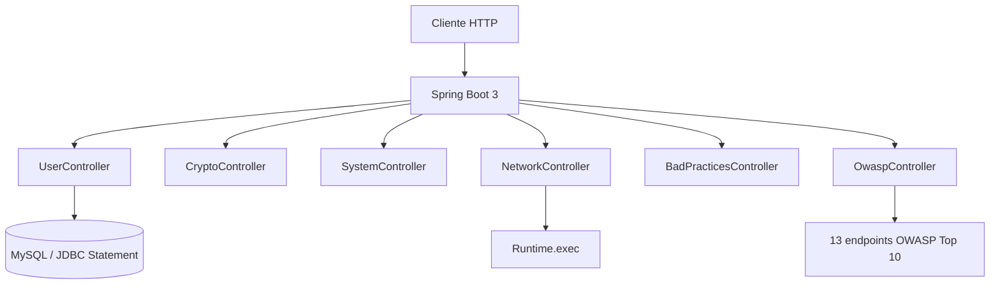
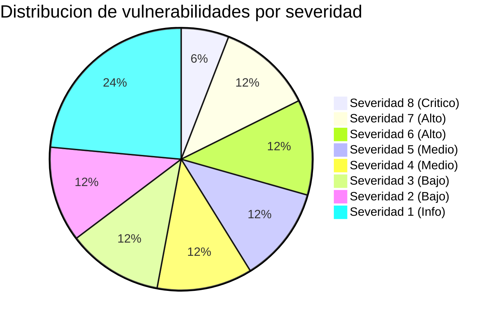

# vulnerable-bank-api

[](https://www.oracle.com/java/)
[](https://spring.io/projects/spring-boot)
[](https://maven.apache.org/)
[](https://owasp.org/Top10/2025/en/)
[](LICENSE)
[](#vulnerabilidades-implementadas)

> [!CAUTION]
> Este proyecto es **intencionalmente inseguro**. Diseñado exclusivamente para fines educativos:
> laboratorios de seguridad, análisis estático/dinámico SAST/DAST, prácticas de pentesting
> en entornos controlados. **No desplegar en producción ni reutilizar como base real.**

---

<div align="center">
  <h2>Banco vulnerable con +20 fallos de seguridad reales</h2>
  <p><strong>17 endpoints · 22 CWEs · Severidades del 1 al 8 · 5 clases explotables</strong></p>
</div>

---

## Objetivo academico

Este repositorio sirve como _playground_ para equipos de seguridad y desarrolladores que quieran:

* Identificar vulnerabilidades **OWASP Top 10 (2025)** en codigo realista
* Practicar **explotacion controlada** y validacion de hallazgos
* Documentar impacto, riesgo y recomendaciones de mitigacion
* Probar herramientas **SAST/DAST** (SonarQube, Checkmarx, ZAP, Burp, etc.)

## Stack tecnologico

| Componente | Version | Proposito |
|---|---|---|
| Java | 21 | Plataforma base |
| Spring Boot | 3.3.x | Framework REST (sin Spring Security) |
| Maven | 3.9+ | Build y dependencias |
| MySQL (JDBC directo) | 8.x | Conexion a BBDD sin JPA/Hibernate |

## Decisiones intencionales (inseguras)

Estas malas practicas se aplican deliberadamente para generar hallazgos:

* Sin Spring Security
* Sin validacion de entradas (todas las requests se aceptan tal cual)
* Sin JPA/Hibernate -> JDBC crudo con `Statement` concatenado
* Sin manejo de excepciones adecuado
* Sin rate limiting, CSRF, CORS, ni sanitizacion de output

## Arquitectura



## Estructura del proyecto

```
src/main/java/com/amalakaky/vuln/
  VulnerableBankApiApplication.java   # Punto de entrada
  rest/
    UserController.java               # SQL Injection + credenciales hardcodeadas
    CryptoController.java              # Hashing debil (MD5)
    SystemController.java              # Path Traversal + anti-patrones
    NetworkController.java             # OS Command Injection
    BadPracticesController.java        # Malas practicas de codigo
    OwaspController.java               # ~13 endpoints OWASP Top 10
```

## Vulnerabilidades implementadas

### Originales

| Endpoint | Vulnerabilidad | CWE | OWASP 2025 |
|---|---|---|---|
| `GET /api/users/balance?username=...` | SQLi + Credenciales hardcodeadas | CWE-89, CWE-798 | A05 Injection, A04 Crypto Failures |
| `POST /api/crypto/hash?password=...` | Hash debil (MD5 sin salt) | CWE-327 | A04 Cryptographic Failures |
| `GET /api/system/download?filename=...` | Path Traversal | CWE-22 | A01 Broken Access Control |
| `POST /api/network/ping?ip=...` | OS Command Injection | CWE-78 | A05 Injection |
| `GET /api/system/risk-score?...` | Anti-patrones (codigo espagueti) | N/A | A10 Mishandling of Exceptional Conditions |

### OWASP Controller — Cobertura Top 10 2025

| Endpoint | CWE | Descripcion | Sev. | OWASP 2025 |
|---|---|---|---|---|
| `GET /api/owasp/xss/comment?text=...` | CWE-79 | Reflected XSS — script sin escapar | 3 | A05 Injection |
| `POST /api/owasp/csrf/transfer` | CWE-352 | Sin token anti-CSRF ni validacion de origen | 4 | A01 Broken Access Control |
| `GET /api/owasp/broken-acl/admin/profile` | CWE-862 | Broken Access Control — acceso sin autenticar | 5 | A01 Broken Access Control |
| `GET /api/owasp/sensitive-data/users` | CWE-200 | Expone datos sensibles de usuarios reales | 2 | A01 Broken Access Control |
| `POST /api/owasp/logging/credentials` | CWE-532 | Credenciales en log en texto plano | 3 | A02 Security Misconfiguration / A09 Logging Failures |
| `POST /api/owasp/ssrf/fetch?url=...` | CWE-918 | SSRF — acceso a metadatos internos | 6 | A01 Broken Access Control |
| `POST /api/owasp/deserialize` | CWE-502 | Insecure Deserialization | 8 | A06 Insecure Design |
| `POST /api/owasp/upload/malicious` | CWE-434 | Subida sin restriccion de tipo/contenido | 7 | A06 Insecure Design |
| `POST /api/owasp/xxe/parse` | CWE-611 | Procesamiento XML con entradas externas | 7 | A06 Insecure Design |
| `GET /api/owasp/rate-limit/loan-check` | CWE-400 | Sin rate limiting — busqueda masiva | 2 | A06 Insecure Design |
| `POST /api/owasp/jwt/weak-secret` | CWE-287 | JWT con clave HMAC debil `"secret"` | 6 | A07 Authentication Failures |
| `GET /api/owasp/weak-crypto/encrypt?data=...` | CWE-326 | DES/ECB — cifrado roto | 5 | A04 Cryptographic Failures |
| `GET /api/owasp/open-redirect?url=...` | CWE-601 | Open Redirect sin validacion | 4 | A08 Software/Data Integrity Failures |

### Severidad baja (INFO)

| Endpoint | CWE | Descripcion | Sev. | OWASP 2025 |
|---|---|---|---|---|
| `GET /api/owasp/debug/error-details?filepath=...` | CWE-209 | Error messages con rutas internas y trazas | 1 | A10 Mishandling of Exceptional Conditions |
| `POST /api/owasp/log/inject?message=...` | CWE-117 | Log Injection — input sin sanitizar | 1 | A09 Logging Failures |
| `GET /api/owasp/debug/security-config` | CWE-547 | Constantes de seguridad hardcodeadas | 1 | A02 Security Misconfiguration |
| `GET /api/owasp/debug/dependencies` | CWE-1104 | Version de dependencias con CVEs conocidos | 1 | A03 Software Supply Chain Failures |

### Cobertura OWASP Top 10 2025

| Categoria | OWASP 2025 | Vulnerabilidades implementadas | Cobertura |
|---|---|---|---|
| Broken Access Control | A01 | Path Traversal, SSRF, CSRF, Sensitive Data Exposure, Broken ACL | 5 |
| Security Misconfiguration | A02 | Credenciales en log, Hardcoded Constants, Error Messages | 3 |
| Software Supply Chain Failures | A03 | Unmaintained Dependencies Info | 1 |
| Cryptographic Failures | A04 | MD5 sin salt, DES/ECB, Hardcoded Credentials | 3 |
| Injection | A05 | SQLi, OS Command Injection, XSS, Log Injection | 4 |
| Insecure Design | A06 | Insecure Deserialization, File Upload, XXE, Missing Rate Limit | 4 |
| Authentication Failures | A07 | JWT con clave debil | 1 |
| Software/Data Integrity Failures | A08 | Open Redirect | 1 |
| Logging & Alerting Failures | A09 | Credenciales en log, Log Injection | 2 |
| Mishandling of Exceptional Conditions | A10 | Error messages, Anti-patrones (BadPracticesController) | 2 |



## Clase de malas practicas

`BadPracticesController` incluye anti-patrones clasicos de forma intencional:

| Anti-patron | Descripcion |
|---|---|
| `if` encadenados (10+ niveles) | Logica imposible de mantener |
| `return` tempranos multiples | Flujo de control caotico |
| Numeros magicos | Constantes sin nombre esparcidas |
| Estado mutable global | `globalCounter` accesible desde cualquier hilo |
| Catch generico | `Exception e` sin log ni manejo |

## Ejecucion local

```bash
cd "C:\Users\skull\IdeaProjects\vulnerable-bank-api"
mvn spring-boot:run
```

La aplicacion arranca en `http://localhost:8080`.

## Ejemplos rapidos

### Originales

```bash
# SQL Injection
curl "http://localhost:8080/api/users/balance?username=alice"
curl "http://localhost:8080/api/users/balance?username=' OR '1'='1"

# Path Traversal
curl "http://localhost:8080/api/system/download?filename=../../../etc/passwd"

# Command Injection
curl -X POST "http://localhost:8080/api/network/ping?ip=127.0.0.1; ls -la"

# MD5 sin salt
curl -X POST "http://localhost:8080/api/crypto/hash?password=123456"
```

### OWASP Top 10

```bash
# XSS
curl "http://localhost:8080/api/owasp/xss/comment?text=<script>alert(1)</script>"

# CSRF
curl -X POST "http://localhost:8080/api/owasp/csrf/transfer?amount=1000&to=atacante"

# SSRF (meta-data AWS)
curl -X POST "http://localhost:8080/api/owasp/ssrf/fetch?url=[http://169.254.169.254/latest/meta-data/](http://169.254.169.254/latest/meta-data/)"

# XXE
curl -X POST "http://localhost:8080/api/owasp/xxe/parse" \
  -H "Content-Type: application/xml" \
  -d '<?xml version="1.0"?><!DOCTYPE foo [<!ENTITY xxe SYSTEM "file:///etc/passwd">]><root>&xxe;</root>'

# Open Redirect
curl -X POST "http://localhost:8080/api/owasp/open-redirect?url=[https://evil.com](https://evil.com)"
```

### Severidad baja (INFO / hallazgos cosmeticos)

```bash
# Error details con rutas internas
curl "http://localhost:8080/api/owasp/debug/error-details?filepath=/etc/passwd"

# Log Injection
curl -X POST "http://localhost:8080/api/owasp/log/inject?message=Inicio%20de%20sesion%20exitoso%20para%20admin"

# Configuracion de seguridad hardcodeada
curl "http://localhost:8080/api/owasp/debug/security-config"

# Versiones de dependencias con CVEs
curl "http://localhost:8080/api/owasp/debug/dependencies"
```

---

> **Proyecto orientado a docencia en ciberseguridad.**
> No desplegar en produccion ni reutilizar este codigo como base de sistemas reales.
